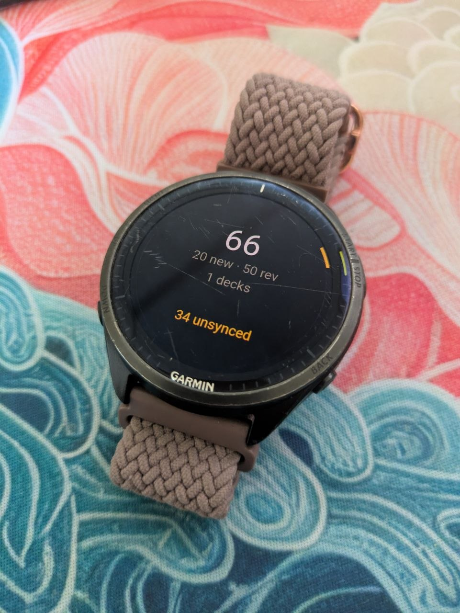
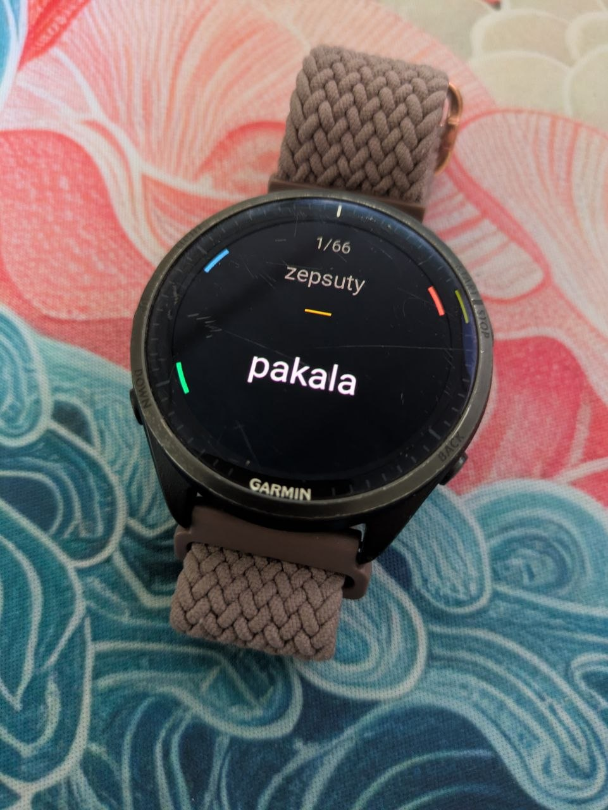
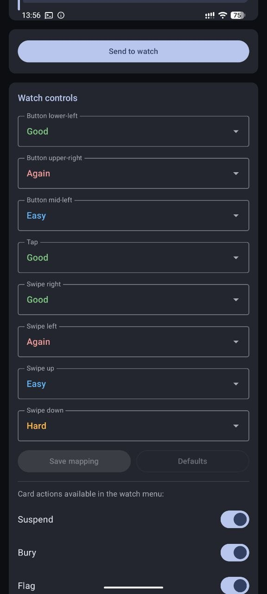

# garmanki

Unofficial Anki client for Garmin watches: a Connect IQ watch-app plus
an Android companion that bridges to [AnkiDroid](https://github.com/ankidroid/Anki-Android)
over Connect IQ BLE messaging. The scheduler stays in AnkiDroid — the
watch only shows cards and reports back how you did.

## Status

The Android companion is currently in **beta on Google Play**. If you
want to try it, request access here: **[sypian.ski/beta](https://sypian.ski/beta)**

The watch app is on the **Connect IQ Store**:
[apps.garmin.com/apps/cc2be8ee-1ea5-4797-b8b0-eb7109d93855](https://apps.garmin.com/apps/cc2be8ee-1ea5-4797-b8b0-eb7109d93855)

## Layout

| Dir | What | Stack |
|---|---|---|
| `watch/` | Connect IQ app (v1 target: fr965; minApiLevel 4.2.1) | Monkey C, SDK 9.x |
| `android/` | companion — AnkiDroid bridge + BLE push | Kotlin, Compose M3, CIQ Mobile SDK 2.4.0 |

See [SCHEMA.md](SCHEMA.md) for the watch↔phone data contract and
[DECYZJE.md](DECYZJE.md) for product decisions.

## Screenshots

  
  
  

